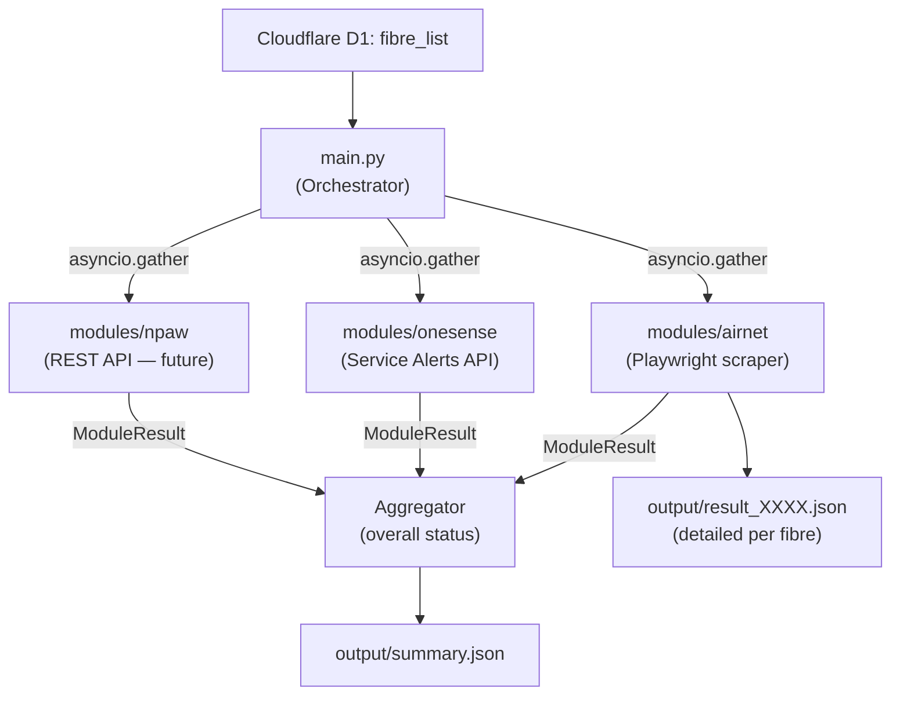

# VIP Proactive Monitoring

ระบบ monitoring แบบ proactive สำหรับตรวจสอบสถานะ fibre ทุกหมายเลขใน `Cloudflare D1 fibre_list`
โดยรวบรวมข้อมูลจาก **3 sources** พร้อมกัน และสรุป overall status ลงไฟล์ `output/summary.json`

---

## Architecture



**Overall status logic** (per fibre):

| Active module results | Overall status |
|---|---|
| ทุก module คืน `normal` | `normal` |
| มี module ไหนคืน `abnormal` | `abnormal` |
| มี module ไหนคืน `error` | `error` |
| modules ที่คืน `N/A` ไม่นับรวม | — |
| ทุก module คืน `N/A` | `unknown` |

---

## Project Structure

```
vip-proactive-monitoring/
├── main.py                          # Orchestrator — อ่าน fibre list, รัน 3 modules, สรุป summary
├── fibre_list.json                   # Migration reference: หมายเลข fibre ทีละบรรทัด
├── .env                             # Credentials & config (git-ignored)
├── .env.example                     # Template สำหรับสร้าง .env
├── requirements.txt                 # Python dependencies
├── common/
│   ├── __init__.py
│   └── models.py                    # ModuleResult dataclass (shared by all modules)
├── modules/
│   ├── __init__.py
│   ├── airnet/                      # Playwright-based web scraper
│   │   ├── __init__.py
│   │   ├── checker.py               # check(fibre_id) -> ModuleResult (entry point)
│   │   ├── auth.py                  # Login automation
│   │   ├── config.py                # .env config loader
│   │   ├── extractor.py             # Historical Usage table extractor
│   │   ├── query.py                 # Customer query & status check
│   │   └── utils.py                 # Retry decorator & logging setup
│   ├── onesense/                    # OneSense Service Alerts API
│   │   ├── __init__.py
│   │   └── checker.py               # check(fibre_id) -> ModuleResult (service alerts)
│   └── npaw/                        # NPAW API (stub — future)
│       ├── __init__.py
│       └── checker.py               # check(fibre_id) -> ModuleResult (returns N/A)
└── output/
    ├── summary.json                 # Main output: overall status ทุก fibre
    └── result_XXXX.json             # Airnet detailed output ต่อ fibre
```

---

## Prerequisites

- **Python** 3.10 or higher
- **Playwright** Chromium browser binaries

---

## Installation

1. **(Optional) Create and activate a virtual environment:**
   ```bash
   python -m venv .venv
   # Windows (PowerShell)
   .venv\Scripts\Activate.ps1
   # Linux/macOS
   source .venv/bin/activate
   ```

2. **Install Python dependencies:**
   ```bash
   pip install -r requirements.txt
   ```

3. **Install Playwright browser binaries:**
   ```bash
   playwright install chromium
   ```

---

## Configuration

Copy `.env.example` to `.env` แล้วกรอก credentials:

```bash
cp .env.example .env
```

```env
# === Airnet (web scraper) ===
BASE_URL=https://your-airnet-portal/AirnetWeb
USERNAME=your_username
PASSWORD=your_password

# === OneSense Service Alerts API ===
ONESENSE_API_URL=https://onesense-db.nattapat-sbs.workers.dev/api/integrations/v1/service-alerts
ONESENSE_API_KEY=

# === NPAW (future REST API) ===
# NPAW_API_URL=
# NPAW_API_KEY=
```

### Cloudflare D1 input

Create a D1 database in the Cloudflare dashboard (Workers & Pages > D1).
Using the database SQL console with write access, run these files in order:

1. `migrations/001_fibre_list.sql` creates the table.
2. `migrations/002_seed_fibre_list.sql` imports the four current fibres with
   names `john`, `mike`, `oven`, and `sucy`, with both device counts set to 1.

The seed skips existing fibre IDs, so rerunning it preserves later edits.
Before starting monitoring, verify the imported data in the SQL console:

```sql
SELECT name, fibre_id, mesh, playbox
FROM fibre_list ORDER BY fibre_id;
```

Expected initial rows (an already-populated database may retain edited values):

| name | fibre_id | mesh | playbox |
|---|---|---|---|
| mike | 8801478464 | 1 | 1 |
| john | 8804133194 | 1 | 1 |
| oven | 8806756368 | 1 | 1 |
| sucy | 8806916302 | 1 | 1 |

Set these values in `.env` using your account ID, database UUID, and an API
token with Account / D1 write permission for the account (required for logs and retention):

```env
CLOUDFLARE_ACCOUNT_ID=your_account_id
CLOUDFLARE_D1_DATABASE_ID=your_database_uuid
CLOUDFLARE_API_TOKEN=your_d1_write_token
```

Run a read-only smoke test before monitoring:

```bash
python -m common.d1_fibres
```

The scraper fetches the four columns once at startup through the Cloudflare
D1 REST API, ordered by `fibre_id`, using a 30-second HTTP timeout. The token
stays in `.env`; schema and seed execution are manual deployment steps.
D1 HTTP requests use `common.api_http.request()` and inherit `PROXY_URL`
routing, just like NPAW and OneSense API calls. Proxy configuration failures stop startup with a non-secret error.

Names and fibre IDs must be non-empty strings without surrounding whitespace.
IDs remain text to preserve leading zeros. `mesh` and `playbox` are nonnegative
integer device counts; booleans, fractions, and numeric strings in API results
are rejected. SQL INTEGER affinity may normalize numeric input before storage.
Missing configuration, failed requests, invalid rows, duplicate IDs, and an empty
table stop startup before checks or summary writes. There is no JSON fallback.

`fibre_list.json` and `fibre_list.txt` are migration references only.
Airnet always runs. OneSense runs once per fibre when `mesh > 0`; NPAW runs once
when `playbox > 0`. Zero counts skip the corresponding module with N/A.
Enabled checks run concurrently per fibre, and fibres run sequentially.
Summary entries include `name` directly from D1, `fibre_id`, and both device counts. Results are saved in local `output/` files and in D1 `log_table`.

Run the automated tests with `python -m unittest discover -s tests`.

---

## Usage

รัน main orchestrator (ตรวจสอบทุก fibre ใน Cloudflare D1):

```bash
python main.py
```

Console output จะแสดงตารางสรุปสถานะ:

```
========================================================================
  VIP Proactive Monitoring — Summary
========================================================================
  Started : 2026-09-01T16:30:00+07:00
  Finished: 2026-09-01T16:35:42+07:00
  Fibres  : 3

  Fibre ID       Overall      Airnet       OneSense     NPAW
  ──────────────────────────────────────────────────────────────
  8800021298     normal       normal       N/A          N/A
  8800052568     abnormal     abnormal     N/A          N/A
  8801815340     normal       normal       N/A          N/A
========================================================================
  normal: 2  abnormal: 1  error: 0  unknown: 0
========================================================================
```

---

## Output Format

### `output/summary.json` — Main summary (สร้างโดย main.py)

```json
{
  "started_at": "2026-09-01T16:30:00+07:00",
  "finished_at": "2026-09-01T16:35:42+07:00",
  "fibre_count": 3,
  "status_counts": { "normal": 2, "abnormal": 1, "error": 0, "unknown": 0 },
  "fibres": [
    {
      "name": "john doe",
      "fibre_id": "8800021298",
      "mesh": 0,
      "playbox": 0,
      "overall_status": "normal",
      "modules": {
        "airnet":   { "status": "normal", "details": { "online_status": "Online", "row_count": 42 } },
        "onesense": { "status": "N/A",    "details": { "message": "Skipped: mesh=0" } },
        "npaw":     { "status": "N/A",    "details": { "message": "Not implemented yet" } }
      }
    }
  ]
}
```

### `output/result_XXXX.json` — Airnet detailed output (per fibre)

```json
{
  "query_number": "8800021298",
  "online_status": "Online",
  "scraped_at": "2026-09-01T16:30:00+07:00",
l      "Customer ID": "88XXXXX298",
      "Service": "INTERNET",
      "IP Address": "100.xxx.xxx.78",
      "Online Time": "01/09/2026 08:00",
      "Download": "6.35 GB",
      "Upload": "547.82 MB"
    }
  ]
}
```

---

## Module Status Values

| Status | ความหมาย |
|---|---|
| `normal` | บริการปกติ |
| `abnormal` | บริการผิดปกติ / offline |
| `error` | module ดึงข้อมูลไม่สำเร็จ |
| `N/A` | module ยังไม่ได้ implement |
| `unknown` | ทุก module คืน N/A (ไม่มีข้อมูล) |

---

## Adding a New Module

เมื่อ OneSense หรือ NPAW API พร้อม ให้แก้ไข `modules/<name>/checker.py`:

1. เพิ่ม API credentials ใน `.env`
2. แก้ `check()` function ให้ call API จริง (ใช้ `httpx` ที่ติดตั้งไว้แล้ว)
3. Map response → `ModuleResult` โดยใช้ status `normal`/`abnormal`/`error`
4. main.py ไม่ต้องแก้ไขใดๆ เลย


## Teams notifications through Power Automate

Each completed CLI run adds `htmlMessage` to `output/summary.json`, saves and
prints the results, then sends one JSON POST when affected services exist and
`POWER_AUTOMATE_URL` is set.
Blank or missing configuration disables sending while retaining the HTML output.

1. Create a Power Automate flow with **When an HTTP request is received**.
   Use this request body schema:

   ```json
   {
     "type": "object",
     "properties": { "htmlMessage": { "type": "string" } },
     "required": ["htmlMessage"]
   }
   ```

2. Add Microsoft Teams **Post a message in a chat or channel** and select the
   destination and posting identity in the flow.
3. In the message body's HTML/code editor, insert the expression
   `triggerBody()?['htmlMessage']` as the body. Do not HTML-escape that expression's
   output or wrap it in a JSON string.
4. Save the flow and copy its generated signed HTTP trigger URL into `.env`:

   ```dotenv
   POWER_AUTOMATE_URL=https://your-generated-trigger-url
   ```

Keep the signed URL private. This sender assumes a signed trigger URL;
Entra-authenticated triggers require a separate authentication extension.
See the [Microsoft Teams connector documentation](https://learn.microsoft.com/en-us/connectors/teams/).

The notification contains one block per affected fibre in input order, with
`Name`, `Fibre ID`, and its existing overall `Status`, followed by a table:

```html
Name: Customer name<br>
Fibre ID: 00123<br>
Status: <span style="color:red">abnormal</span><br><br>
<table>
  <tr><th>Service</th><th>Detail</th></tr>
  <tr><td>NPAW</td><td>Status: <span style="color:red">abnormal</span><p>Errors: ["Playback failed"]</p></td></tr>
</table>
```

Services marked `abnormal`, `error`, or `unknown` appear, ordered Smart7
(Airnet), NPAW, then OneSense. Fibres without affected services are omitted.
Each message starts with bold **VIP proactive monitoring**, the completion time
as `YYYY-MM-DD HH:MM:SS (UTC+7)`, and the overall run status. All message
statuses use lowercase text: red for abnormal/error, amber for unknown, and
green for normal, without emojis.
NPAW preserves `details.errors` as JSON. Smart7 displays online status without
its row count; collection and abnormal detection are unchanged.
OneSense shows readable incident details and coverage reasons. Failed checks
display `Retrieval failed` and a safe OneSense failure description where
available; raw diagnostics are excluded. All dynamic HTML is escaped.

Runs without affected services save `htmlMessage: ""` and skip delivery.
Complete monitoring results still appear in JSON, console output, and D1 logs.
Messages exceeding 24 KiB of UTF-8 HTML (including the header) first omit whole
OneSense alert entries from the end, then whole fibre blocks. Omission notices
refer to the full results in `summary.json`.

Delivery uses the shared proxy-aware HTTP helper and its timeout settings. HTTP
2xx means the flow accepted the request, not confirmation that Teams posted it.
Other responses and network failures produce a sanitized log message and exit
code 1 after results have been saved. Requests are not automatically retried;
check flow run history before manually retrying an ambiguous timeout.

For rollout, configure the flow destination and URL, run `python main.py`, and
verify the affected-fibre tables and API details in Teams and the flow history.
A healthy run should produce no post.
The offline test suite uses mocked delivery and sends no Teams messages.

### Testing Teams message scenarios

Use a simulated scenario to review the exact Teams HTML without calling live
monitoring APIs or D1. Test runs write `output/test-summary.json` and do not
send a message unless `--send-teams` is explicitly supplied:

```bash
python main.py --test-scenario npaw-errors
python main.py --test-scenario all-errors --send-teams
```

Available scenarios are `smart7-offline`, `smart7-recent-offlines`,
`smart7-error`, `npaw-errors`, `npaw-long-metadata`,
`npaw-oversize-metadata`, `npaw-error`, `onesense-alerts`, `onesense-error`,
`all-errors`, and `all-abnormal`. The recent-offline scenario represents three
Historical Usage offline rows in 30 minutes. The oversize-metadata scenario
verifies the 24 KiB Teams HTML limit. Test messages include a
`TEST: <scenario>` label. Before adding `--send-teams`, set
`POWER_AUTOMATE_URL` to a Flow that posts only to a test chat or channel.

## API proxy configuration

D1, NPAW, and OneSense use `common.api_http.request()`, which reads `PROXY_URL`
from `.env`.
Set `PROXY_URL=http://proxy.example.com:8080` to route API requests through
an explicit HTTP or HTTPS proxy. Proxy credentials in the URL are supported
and redacted from route diagnostics. No PAC file is downloaded or evaluated.
Invalid proxy configuration stops D1 startup or returns a monitoring module
error. D1 overrides the API request timeout to 30 seconds; NPAW uses the
helper defaults of 15 seconds to connect and 60 seconds to read.
Leave `PROXY_URL` blank to preserve HTTPX's standard `HTTP_PROXY`,
`HTTPS_PROXY`, and `NO_PROXY` behavior.

OneSense uses the same proxy routing and timeout defaults.

Install dependencies and run the offline proxy tests:

```powershell
python -m pip install -r requirements.txt
python -m unittest discover -s tests -v
```


## JSON input checklist

- [x] Load and validate JSON fibre records before checks.
- [x] Select OneSense/NPAW using positive mesh/playbox device counts.
- [x] Include device counts and skip reasons in the summary.
- [x] Test input validation, selection, and aggregation.
- [ ] Verify imported device counts in D1 before monitoring.
- [x] Integrate OneSense service alerts using the shared proxy helper.


## OneSense service alerts

Configure the complete endpoint URL and integration key in `.env`; the key is
sent only in the `x-api-key` header. For fibres with `mesh > 0`, each check sends
the unchanged fibre ID as `service_name`, with `range=15m`, `limit=50`, and
`offset=0`. Query parameters in the configured URL are replaced.

The checker follows `next_offset` with the first response's `as_of`, and
deduplicates by `alert_id`. Both OPEN and CLOSED incidents count when the API
reports overlap with the window. Repeated runs can report the same incident.
The API's service status is authoritative; an empty page alone is not healthy.
Overall priority is `error > abnormal > unknown > normal`, excluding `N/A`.

Missing configuration, HTTP failures (including service-not-found), invalid
responses and incomplete pagination produce `error`. Previously fetched
alerts remain available with `incomplete: true`; failed requests are not retried
within a run. Scheduled monitoring tries again at the next cycle.

Teams includes incident type, severity, target, agent/ISP, state, timestamps,
duration, overlap, summary and available metrics with units. Unknown results
notify with the coverage reason. Full alert objects, including traceroute,
are retained in summary results and the existing OneSense D1 log serialization;
raw traceroute is omitted from Teams. Metrics describe the incident lifetime,
not necessarily only the selected 15 minutes.

## Scheduled monitoring and run history

Before running the updated application, execute `migrations/003_log_table.sql`
in the SQL console of the existing Cloudflare D1 database. It creates
`log_table` and an index on `created_at`; rerunning the migration is safe.
The application does not create or migrate tables automatically. Configure
`CLOUDFLARE_API_TOKEN` with D1 write access; a read-only token cannot insert
logs or delete expired rows. The same database and proxy settings serve reads
and writes.

```bash
# Run once
python main.py

# Keep running every quarter hour
python main.py --cron
```

Scheduled mode waits until the next Bangkok-time `:00`, `:15`, `:30`, or `:45`
boundary before its first run. Keep the process running; this command does not
install an OS cron job. Ctrl+C stops it. Each cycle reloads the fibre list.
Runs do not overlap within the process: if a run takes more than 15 minutes,
missed boundaries are skipped. Use only one scheduler process per deployment.
Failures are logged and the scheduler continues at the next future boundary.

Each completed monitoring run inserts one row with an automatically assigned
integer `id`, UTC completion `created_at` (fixed microsecond ISO timestamp ending
in `Z`), and `log_airnet`, `log_npaw`, `log_onesense` JSON text arrays. Each array
contains the module's existing serialized results in fibre order: `source`,
`fibre_id`, `status`, `details`, and `checked_at`. Failed and skipped results
(`error` and `N/A`) are included, as are unknown results. Raw scraped history and extra API response
payloads are not copied into this table. Module check times keep their existing
Bangkok offset.

Every one-shot invocation or scheduled cycle attempts cleanup before loading
fibres, deleting only rows strictly older than 30 days in UTC. Rows exactly at
the cutoff remain. Cleanup still runs when input loading fails. It only affects
`log_table`, not the fibre list or local output files. Retention runs while the
application runs; downtime delays cleanup until the next cycle.

The local summary is saved and the D1 log is attempted before Teams delivery.
Database cleanup or insert failures do not prevent monitoring or notification;
one-shot mode exits with status 1 if either operation or notification fails.
Startup failures before results exist do not create a run-log row. Failed log
inserts are reported and are not automatically retried or backfilled.

### Airnet abnormal rules

Airnet is abnormal when either the portal status equals `Offline`
(case-insensitive), or at least three Historical Usage rows have an `Offline
Time` in the last 30 minutes. The window includes both endpoints, uses Bangkok
time, and is relative to the check start captured before scraping, rounded down
to the minute. Timestamps use `DD/MM/YYYY HH:MM`. Duplicate rows count separately.
Missing, empty, unparseable, older, and future timestamps do not count.

Scraping failures return `error`. Otherwise, when neither abnormal condition is
met, Airnet returns `normal`, even for an unrecognized portal status. These
existing rules have not changed.
