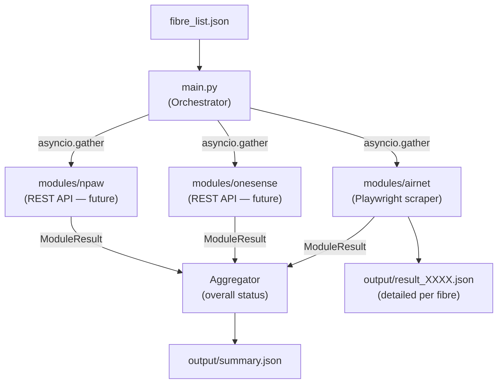

# VIP Proactive Monitoring

ระบบ monitoring แบบ proactive สำหรับตรวจสอบสถานะ fibre ทุกหมายเลขใน `fibre_list.json`
โดยรวบรวมข้อมูลจาก **3 sources** พร้อมกัน และสรุป overall status ลงไฟล์ `output/summary.json`

---

## Architecture



**Overall status logic** (per fibre):

| Active module results | Overall status |
|---|---|
| ทุก module คืน `normal` | `normal` |
| มี module ไหนคืน `abnormal` | `abnormal` |
| มี module ไหนคืน `error` | `error` |
| modules ที่คืน `N/A` ไม่นับรวม | — |
| ทุก module คืน `N/A` | `unknown` |

---

## Project Structure

```
vip-proactive-monitoring/
├── main.py                          # Orchestrator — อ่าน fibre list, รัน 3 modules, สรุป summary
├── fibre_list.json                   # Input: หมายเลข fibre ทีละบรรทัด
├── .env                             # Credentials & config (git-ignored)
├── .env.example                     # Template สำหรับสร้าง .env
├── requirements.txt                 # Python dependencies
├── common/
│   ├── __init__.py
│   └── models.py                    # ModuleResult dataclass (shared by all modules)
├── modules/
│   ├── __init__.py
│   ├── airnet/                      # Playwright-based web scraper
│   │   ├── __init__.py
│   │   ├── checker.py               # check(fibre_id) -> ModuleResult (entry point)
│   │   ├── auth.py                  # Login automation
│   │   ├── config.py                # .env config loader
│   │   ├── extractor.py             # Historical Usage table extractor
│   │   ├── query.py                 # Customer query & status check
│   │   └── utils.py                 # Retry decorator & logging setup
│   ├── onesense/                    # OneSense API (stub — future)
│   │   ├── __init__.py
│   │   └── checker.py               # check(fibre_id) -> ModuleResult (returns N/A)
│   └── npaw/                        # NPAW API (stub — future)
│       ├── __init__.py
│       └── checker.py               # check(fibre_id) -> ModuleResult (returns N/A)
└── output/
    ├── summary.json                 # Main output: overall status ทุก fibre
    └── result_XXXX.json             # Airnet detailed output ต่อ fibre
```

---

## Prerequisites

- **Python** 3.10 or higher
- **Playwright** Chromium browser binaries

---

## Installation

1. **(Optional) Create and activate a virtual environment:**
   ```bash
   python -m venv .venv
   # Windows (PowerShell)
   .venv\Scripts\Activate.ps1
   # Linux/macOS
   source .venv/bin/activate
   ```

2. **Install Python dependencies:**
   ```bash
   pip install -r requirements.txt
   ```

3. **Install Playwright browser binaries:**
   ```bash
   playwright install chromium
   ```

---

## Configuration

Copy `.env.example` to `.env` แล้วกรอก credentials:

```bash
cp .env.example .env
```

```env
# === Airnet (web scraper) ===
BASE_URL=https://your-airnet-portal/AirnetWeb
USERNAME=your_username
PASSWORD=your_password

# === OneSense (future REST API) ===
# ONESENSE_API_URL=
# ONESENSE_API_KEY=

# === NPAW (future REST API) ===
# NPAW_API_URL=
# NPAW_API_KEY=
```

Edit `fibre_list.json` with confirmed flags. Example only:

```json
[
  {"name": "VIP customer 1", "fibre_id": "8804133194", "mesh": 1, "playbox": 0},
  {"name": "VIP customer 2", "fibre_id": "8801478464", "mesh": 0, "playbox": 1}
]
```

`name` and IDs must be non-empty strings; leading zeros in IDs are preserved.
Flags must be integer 0 or 1. Replace all migrated `null` flags with confirmed
values before running. Unset flags fail validation before any checks start.
Duplicate IDs, missing fields, malformed JSON, and empty lists are rejected.
`fibre_list.txt` remains a migration reference and is never loaded at runtime.

Airnet always runs. OneSense runs only with mesh=1; NPAW only with playbox=1.
Disabled modules return N/A with a skip reason and make no requests.
Enabled checks run concurrently per fibre, and fibres run sequentially.
Summary entries include mesh and playbox. OneSense remains a stub until its API
is provided; its future implementation must use the shared PAC request helper.

---

## Usage

รัน main orchestrator (ตรวจสอบทุก fibre ใน fibre_list.json):

```bash
python main.py
```

Console output จะแสดงตารางสรุปสถานะ:

```
========================================================================
  VIP Proactive Monitoring — Summary
========================================================================
  Started : 2026-09-01T16:30:00+07:00
  Finished: 2026-09-01T16:35:42+07:00
  Fibres  : 3

  Fibre ID       Overall      Airnet       OneSense     NPAW
  ──────────────────────────────────────────────────────────────
  8800021298     normal       normal       N/A          N/A
  8800052568     abnormal     abnormal     N/A          N/A
  8801815340     normal       normal       N/A          N/A
========================================================================
  normal: 2  abnormal: 1  error: 0  unknown: 0
========================================================================
```

---

## Output Format

### `output/summary.json` — Main summary (สร้างโดย main.py)

```json
{
  "started_at": "2026-09-01T16:30:00+07:00",
  "finished_at": "2026-09-01T16:35:42+07:00",
  "fibre_count": 3,
  "status_counts": { "normal": 2, "abnormal": 1, "error": 0, "unknown": 0 },
  "fibres": [
    {
      "name": "VIP customer 1",
      "fibre_id": "8800021298",
      "overall_status": "normal",
      "modules": {
        "airnet":   { "status": "normal", "details": { "online_status": "Online", "row_count": 42 } },
        "onesense": { "status": "N/A",    "details": { "message": "Not implemented yet" } },
        "npaw":     { "status": "N/A",    "details": { "message": "Not implemented yet" } }
      }
    }
  ]
}
```

### `output/result_XXXX.json` — Airnet detailed output (per fibre)

```json
{
  "query_number": "8800021298",
  "online_status": "Online",
  "scraped_at": "2026-09-01T16:30:00+07:00",
  "row_count": 42,
  "data": [
    {
      "Customer ID": "88XXXXX298",
      "Service": "INTERNET",
      "IP Address": "100.xxx.xxx.78",
      "Online Time": "01/09/2026 08:00",
      "Download": "6.35 GB",
      "Upload": "547.82 MB"
    }
  ]
}
```

---

## Module Status Values

| Status | ความหมาย |
|---|---|
| `normal` | บริการปกติ |
| `abnormal` | บริการผิดปกติ / offline |
| `error` | module ดึงข้อมูลไม่สำเร็จ |
| `N/A` | module ยังไม่ได้ implement |
| `unknown` | ทุก module คืน N/A (ไม่มีข้อมูล) |

---

## Adding a New Module

เมื่อ OneSense หรือ NPAW API พร้อม ให้แก้ไข `modules/<name>/checker.py`:

1. เพิ่ม API credentials ใน `.env`
2. แก้ `check()` function ให้ call API จริง (ใช้ `httpx` ที่ติดตั้งไว้แล้ว)
3. Map response → `ModuleResult` โดยใช้ status `normal`/`abnormal`/`error`
4. main.py ไม่ต้องแก้ไขใดๆ เลย


## API proxy configuration

NPAW uses `common.api_http.request()` and reads `API_PAC_URL` from `.env`.
The PAC is fetched directly with a 15-second timeout and evaluated for the
actual API URL and hostname. Following the supplied helper, only its first
rule is used: `PROXY host:port` or `DIRECT`. Unsupported rules and PAC failures
return a module error without silently bypassing the configured route.
API requests use a 15-second connection timeout and a 60-second read timeout.
Leave `API_PAC_URL` blank to use HTTPX's standard environment proxy settings.

OneSense remains a stub until its API contract is available. Its future API
requests must use `common.api_http.request()` so they use the same PAC routing.

Install dependencies and run the offline proxy tests:

```powershell
python -m pip install -r requirements.txt
python -m unittest discover -s tests -v
```


## JSON input checklist

- [x] Load and validate JSON fibre records before checks.
- [x] Select OneSense/NPAW using mesh/playbox flags.
- [x] Include flags and skip reasons in the summary.
- [x] Test input validation, selection, and aggregation.
- [ ] Supply confirmed device flags for all migrated fibres.
- [ ] Integrate OneSense when its API is available, using the shared PAC helper.
