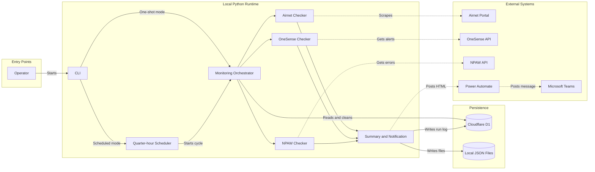
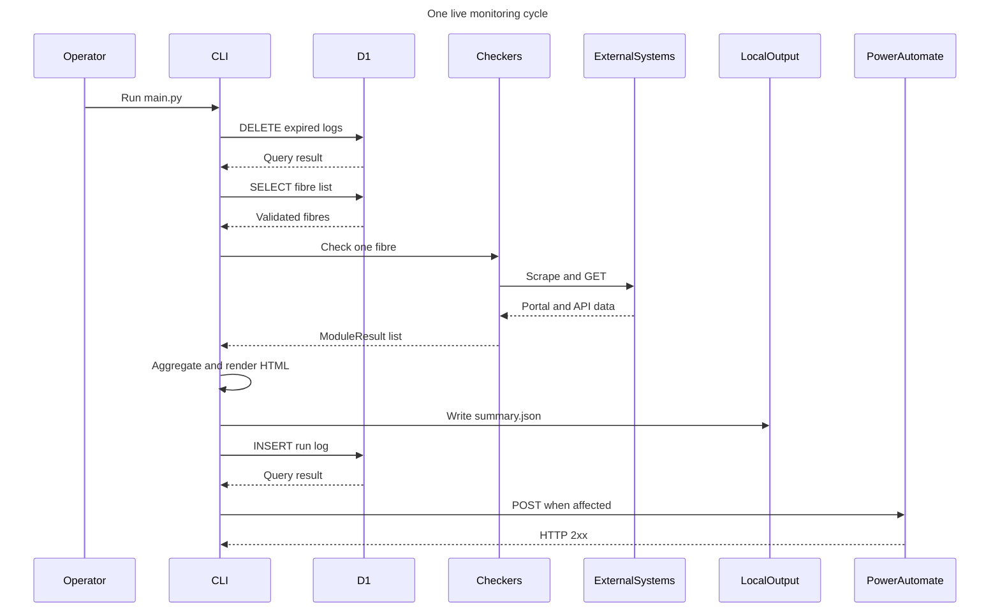
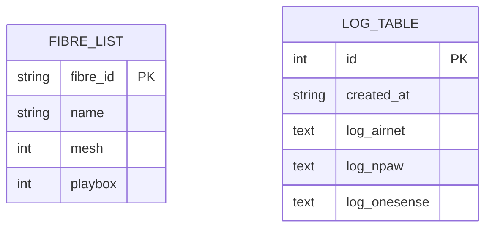
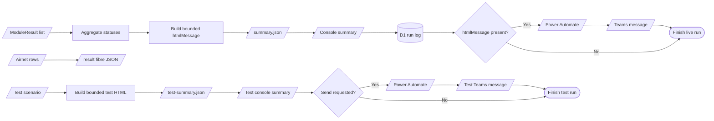

# VIP Proactive Monitoring: Application Flow

## Purpose

This command-line application monitors every fibre listed in Cloudflare D1. For each fibre it checks Smart7/Airnet, OneSense when mesh devices exist, and NPAW when Playbox devices exist. The checkers return a shared `ModuleResult`, which the orchestrator aggregates into per-fibre and whole-run results, saves locally and in D1, and conditionally sends to Microsoft Teams through Power Automate.

## Runtime modes

| Command | Behaviour |
|---|---|
| `python main.py` | Runs one live monitoring cycle. It exits with `1` for an input/startup failure or failed cleanup, run-log persistence, or Teams delivery; monitored `abnormal` and module `error` statuses do not by themselves change the exit code. |
| `python main.py --cron` | Waits for the next Bangkok-time `:00`, `:15`, `:30`, or `:45` boundary, runs one cycle, and repeats. Cycles never overlap; elapsed boundaries are skipped. |
| `python main.py --test-scenario <name> [--send-teams]` | Builds a synthetic result without D1 or live monitoring, writes `output/test-summary.json`, and sends it only when `--send-teams` is supplied. |

`--cron` cannot be combined with `--test-scenario`, and `--send-teams` requires a test scenario.

## System architecture



API traffic from D1, OneSense, NPAW, and Power Automate uses the shared HTTP transport. `PROXY_URL` selects an explicit HTTP/HTTPS proxy; when blank, HTTPX honours the standard proxy environment variables. The Playwright browser used by Airnet does not use this helper.

## Live monitoring flow



The CLI processes fibres **sequentially**. Within one fibre, all enabled checkers run **concurrently** with `asyncio.gather`; an unhandled checker exception is converted to an `error` result so the other results remain usable.

### Module selection and status

| Module | Selection | Possible result |
|---|---|---|
| Airnet / Smart7 | Always selected | `normal`, `abnormal`, or `error` |
| OneSense | Selected when `mesh > 0`; otherwise skipped | `normal`, `unknown`, `abnormal`, `error`, or `N/A` |
| NPAW | Selected when `playbox > 0`; otherwise skipped | `normal`, `abnormal`, `error`, or `N/A` |

Airnet is `abnormal` when the portal status is `Offline` (case-insensitive), or when at least three Historical Usage rows have an `Offline Time` within the inclusive previous 30 minutes in Bangkok time. Login, query, and extraction stages retry up to three times with exponential backoff.

The overall fibre status is the highest active severity:

```text
error > abnormal > unknown > normal
```

`N/A` is excluded. If every module is `N/A`, the overall status is `unknown`. The whole-run status used in Teams applies the same order without `N/A`.

## Request and response contracts

| Integration | Request | Accepted response |
|---|---|---|
| Cloudflare D1 | `POST /client/v4/accounts/{account}/d1/database/{database}/query` with a bearer token and `{"sql":"...","params":[...]}`. Reads use `SELECT name, fibre_id, mesh, playbox FROM fibre_list ORDER BY fibre_id`; cleanup and logging use parameterized `DELETE` and `INSERT`. | JSON object with `success: true`, exactly one `result` item with `success: true`, and a `results` array. D1 requests use a 30-second timeout. |
| Airnet portal | Playwright opens `BASE_URL`, logs in, submits the 10-digit fibre ID, reads the online status, and extracts up to the first 14 Historical Usage columns. | DOM content: an online-status value and at least one Historical Usage row. There is no JSON API contract. |
| OneSense | `GET ONESENSE_API_URL` with `x-api-key`; query parameters are `service_name`, `range=15m`, `limit=50`, `offset`, and then the first page's `as_of` for continuation pages. | HTTP `200` JSON with status `normal`, `unknown`, or `abnormal`; matching service/range/window metadata; valid pagination; and validated alert objects. Alerts are deduplicated by integer `alert_id`. |
| NPAW | `GET NPAW_API_URL?internetId={fibre_id}` with no application authentication. | JSON object with case-insensitive `status` of `Normal` or `Abnormal` and an `errors` array. A normal response may omit `errors`. |
| Power Automate | One `POST` to the private signed `POWER_AUTOMATE_URL` with `{"htmlMessage":"<escaped HTML>"}`. | Any HTTP `2xx` means the flow accepted the request; it does not prove that Teams posted the message. |

OneSense follows `next_offset` while `has_more` is true and keeps the first page's `as_of` fixed. Invalid or incomplete pagination produces `error`; already validated alerts are retained with `incomplete: true`. OneSense, NPAW, and notification requests are not retried within a run.

## D1 data model



There is intentionally no foreign key between these tables. `log_table` is a denormalized run history: each `log_*` column contains a JSON-text array of that module's results for every fibre in input order. The application deletes rows whose UTC `created_at` is strictly older than 30 days; a row exactly at the cutoff is retained.

## Output pipeline



### Local JSON

`output/summary.json` contains the complete live result. `htmlMessage` is added before the file is saved.

```json
{
  "started_at": "2026-09-11T10:00:00+07:00",
  "finished_at": "2026-09-11T10:00:30+07:00",
  "fibre_count": 1,
  "status_counts": {
    "normal": 0,
    "abnormal": 1,
    "error": 0,
    "unknown": 0
  },
  "fibres": [
    {
      "name": "example customer",
      "fibre_id": "0012345678",
      "mesh": 0,
      "playbox": 0,
      "overall_status": "abnormal",
      "modules": {
        "airnet": {
          "source": "airnet",
          "fibre_id": "0012345678",
          "status": "abnormal",
          "details": {
            "online_status": "Offline",
            "row_count": 1,
            "recent_offline_rows": 1,
            "output_file": "<project-root>/output/result_0012345678.json"
          },
          "checked_at": "2026-09-11T10:00:01+07:00"
        },
        "onesense": {
          "source": "onesense",
          "fibre_id": "0012345678",
          "status": "N/A",
          "details": { "message": "Skipped: mesh=0" },
          "checked_at": "2026-09-11T10:00:00+07:00"
        },
        "npaw": {
          "source": "npaw",
          "fibre_id": "0012345678",
          "status": "N/A",
          "details": { "message": "Skipped: playbox=0" },
          "checked_at": "2026-09-11T10:00:00+07:00"
        }
      }
    }
  ],
  "htmlMessage": "<b>VIP proactive monitoring</b><br>..."
}
```

Airnet also writes `output/result_<fibre_id>.json` before returning its module result:

```json
{
  "query_number": "0012345678",
  "online_status": "Offline",
  "scraped_at": "2026-09-11T10:00:20+07:00",
  "row_count": 1,
  "data": [
    {
      "Customer ID": "0012345678",
      "Service": "INTERNET",
      "Offline Time": "11/09/2026 09:59"
    }
  ]
}
```

`output/test-summary.json` has the same summary structure, adds `"testScenario": "<scenario>"`, and never replaces the live summary.

### D1 run history

Every completed live run attempts to insert one `log_table` row after saving and printing the local summary. Each module column stores a serialized array shaped as follows:

```json
[
  {
    "source": "airnet",
    "fibre_id": "0012345678",
    "status": "abnormal",
    "details": {
      "online_status": "Offline"
    },
    "checked_at": "2026-09-11T10:00:01+07:00"
  }
]
```

The run-log arrays include `error`, `unknown`, and `N/A` results. They do not copy raw Airnet history rows or unrelated top-level API payloads.

### Console and Teams

The console prints timestamps, fibre count, one row per fibre, per-module statuses, and final status counts. It is printed after `summary.json` is saved and before D1 run-log persistence and Teams delivery.

Teams HTML includes only services whose status is `abnormal`, `error`, or `unknown`, ordered Smart7, NPAW, then OneSense. Dynamic content is HTML-escaped and operational fields such as credentials, URLs, headers, diagnostics, and raw traceroutes are excluded. When the message exceeds 24 KiB, complete OneSense alerts are removed from the end first, then complete fibre blocks; omission notices point to `summary.json`. If no affected service exists, `htmlMessage` is empty and delivery is skipped.

## Failure and scheduling behaviour

- Cleanup is attempted before reading `fibre_list`. Cleanup failure is logged, monitoring continues, and one-shot mode ultimately exits with `1`.
- Missing D1 configuration, a failed D1 read, invalid or duplicate records, or an empty fibre list stops the cycle before monitoring and summary creation. No run-log row is created.
- Module retrieval and validation failures become sanitized `error` results where possible; other fibres continue.
- Local summary save and console output happen before D1 run-log persistence and Teams delivery. A later persistence or delivery failure does not remove the local results, but one-shot mode exits with `1`.
- Scheduled mode reloads the fibre list on every cycle, skips missed quarter-hour boundaries, and continues after a failed cycle. Only one scheduler process should run per deployment.
- Retention is enforced only while the application runs, so downtime delays cleanup until the next live cycle.

## Source map

- [`main.py`](../main.py): CLI modes, scheduling, orchestration, aggregation, and output order.
- [`common/models.py`](../common/models.py): shared `ModuleResult` schema and status vocabulary.
- [`common/d1_fibres.py`](../common/d1_fibres.py) and [`common/d1_logs.py`](../common/d1_logs.py): D1 input, run-history persistence, and retention.
- [`common/teams_notification.py`](../common/teams_notification.py): Teams HTML filtering, size limits, and Power Automate delivery.
- [`modules/airnet/checker.py`](../modules/airnet/checker.py), [`modules/onesense/checker.py`](../modules/onesense/checker.py), and [`modules/npaw/checker.py`](../modules/npaw/checker.py): source-specific checks and validation.
- [`migrations/001_fibre_list.sql`](../migrations/001_fibre_list.sql) and [`migrations/003_log_table.sql`](../migrations/003_log_table.sql): deployed D1 schema.
